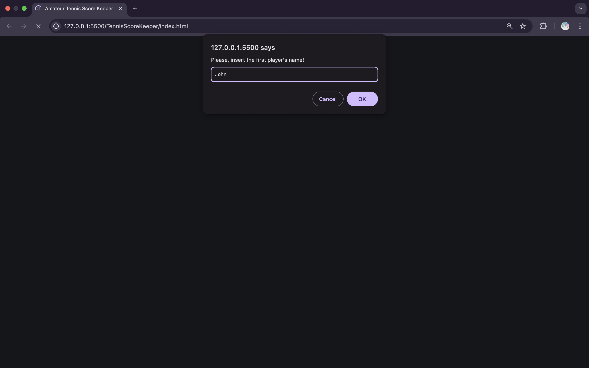
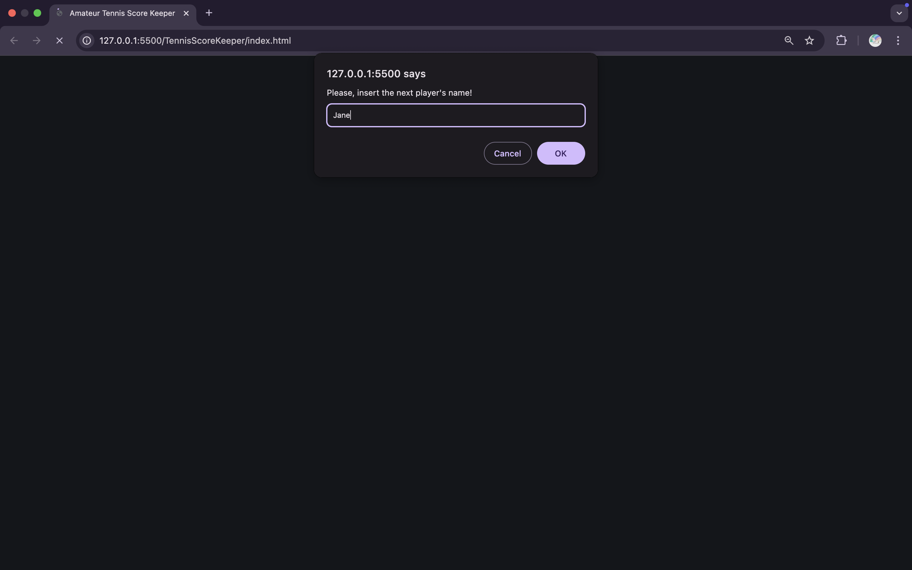
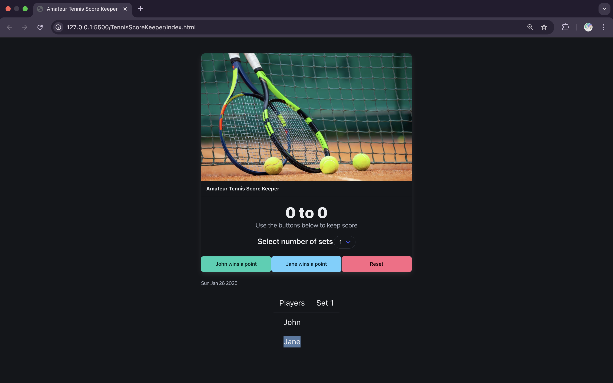
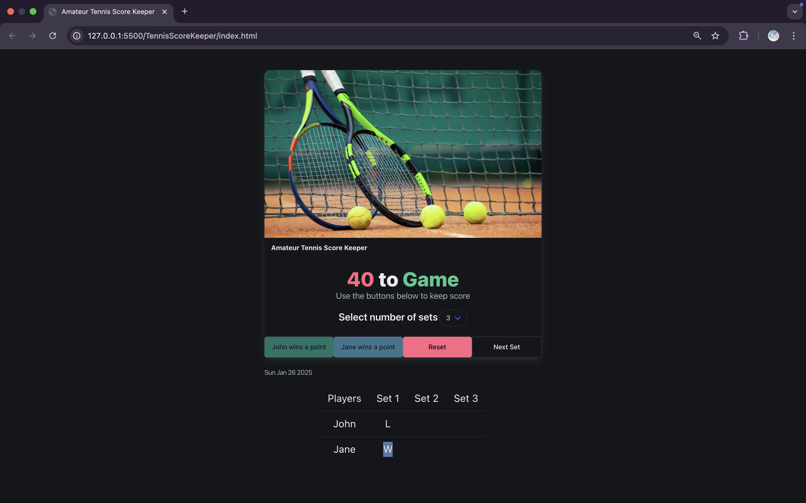
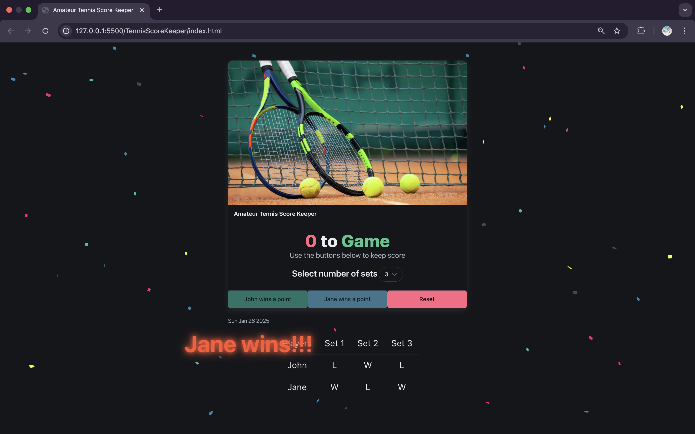

# Tennis Score Keeper 🎾
Tennis Score Keeper is a simple and intuitive web-based application that allows users to keep track of tennis scores during matches. Designed with a user-friendly interface, it is perfect for players, coaches, or spectators looking to monitor game progress in real-time.

## Features
- Real-Time Scoring: Update and display scores dynamically during the match.
- Player Customization: Input player names at the start of the game.
- Game Progress Tracking: Monitor individual sets and overall scores.
- Winner Announcement: Celebrate the winner with a dynamic visual effect.

## Installation
To run this application locally, follow these steps:
1. **Clone the Repository**:
   ```bash
   git clone https://github.com/andyTuruu/tennis_score_keeper.git
   cd tennis_score_keeper
2. Open the application
- Locate the index.html file in the project directory.
- Go to your code editor and open it with preferred web browser.

## Usage
1. Start the game:
- Input the names of both players in the prompts at the start.




2. Choose the number of sets to determine the winner.


3. Track Scores:
- Use the "[Player] wins a point" buttons to record scores for each player.


4. Proceed or Reset:
- Move to the next set when a player wins the current one.
- Reset the game anytime using the "Reset" button.


5. Winner accouncement:
- The application will automatically declare and congratulate the winner once the game concludes.  



